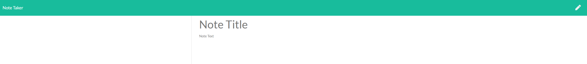
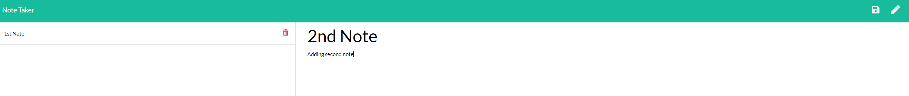
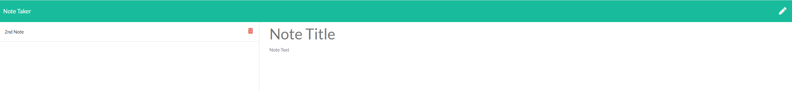

# Note-Taker

---

Title: Note-Taker
Created By: Gerson Marroquin
Date: 7/25/2020

Website: https://thawing-atoll-55643.herokuapp.com/

---

## Description

This application is to assist a user with keeping track of their thoughts. This application will allow user to add notes and will load to the left side of the page dynamically.
User will be able to go back and view the notes that they input. Users will also be able to delete individual notes that they no longer need and it will not delete any other notes.

## Installation

In order to run this application it will require express, path. mysql was installed in this process, but not required.

## Images of working file in Heroku

## Demo

